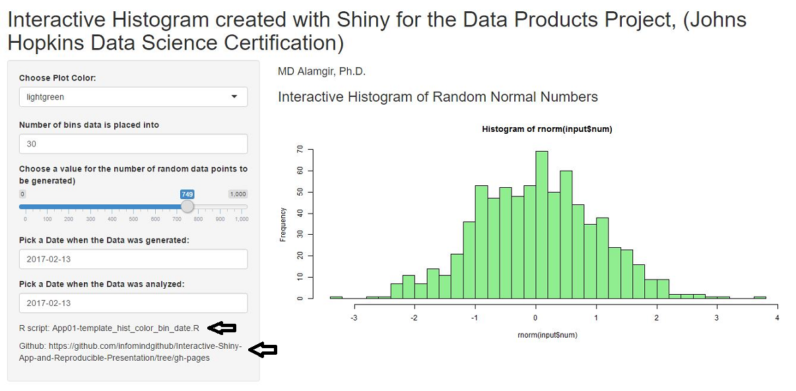

```{r setup, include=FALSE}
knitr::opts_chunk$set(echo = FALSE)
```

## Objectives

*Create an interactive Shiny Application and deploy it on R-Studio Servers.

*Use R-Studio Presenter to prepare a reproducible pitch about the Application
##


## Architecture of the Shiny Interactive Application

- Two plots are created with plotly  
- One plot with the original dataset
- The other plot with up to +/-20% uncertainty in length and dose data
- The uncertainty in length and dose data are created using the runif() function

## TootGrowth Data Sample

```{r, echo=TRUE, message=FALSE}
setwd("C:/Users/MD/Documents/Week4_Statistical_Inference")
library(datasets)
library(plotly)
library(dplyr)
```
```{r, Explore Data, echo=TRUE, message=FALSE}
data("ToothGrowth")
head(ToothGrowth, 5)

```
## Plot of Tooth Growth vs. Dose

```{r, tooth growth plot, original, echo=FALSE}
set.seed(23888)
ndata=nrow(ToothGrowth)
plot_ly(ToothGrowth, x=dose, y=len, mode="markers", color=as.factor(dose), size=2*sqrt(len*dose))

```

## Add data columns to include up to 20% uncertainty

```{r,add columns for data with uncertainty, echo=TRUE}
set.seed(23097)
ndata=nrow(ToothGrowth)
ToothGrowth$lenadj=ToothGrowth$len*runif(ndata, min=0.8, max=1.2)
ToothGrowth$doseadj=ToothGrowth$dose*runif(ndata, min=0.8, max=1.2)
head(ToothGrowth)
```

## Plot (with Data uncertainty)

```{r, tooth growth plot uncertainty included, echo=TRUE}
plot_ly(ToothGrowth, x=doseadj, y=lenadj, mode="markers",
        color=as.factor(dose), size=2*sqrt(lenadj*doseadj))
```
```{r, shiny app}
library(shiny)
ui=(pageWithSidebar(
        headerPanel("Interactive Histogram created with Shiny for the Data Products Project, (Johns Hopkins Data Science Certification)"),
        sidebarPanel(
                selectInput("textinput1", "Choose Plot Color:", choices = c('lightgreen','red', 'blue')),                
                numericInput('id1', 'Number of bins data is placed into', 5, min = 5, max = 100, step=5),
                sliderInput("num", "Choose a value for the number of random data points to be generated)",0, 1000,70, 0.5),
                dateInput("date1", "Pick a Date when the Data was generated:"),
                dateInput("date2", "Pick a Date when the Data was analyzed:")
        ),
        
        mainPanel(
                h4('MD Alamgir, Ph.D.'),
                h3('Interactive Histogram of Random Normal Numbers'),
                plotOutput(outputId = "histogram")
        )
)
)

#-------server code---

server<-function(input, output)
        {
        output$oid1 = renderPrint({input$id1})
        output$oid2 = renderPrint({input$id2})
        output$odate = renderPrint({input$date2-input$date1})
        output$histogram = renderPlot({hist(rnorm(input$num), col=input$textinput1, breaks = input$id1)})
        }
shinyApp(ui=ui, server=server)

```


